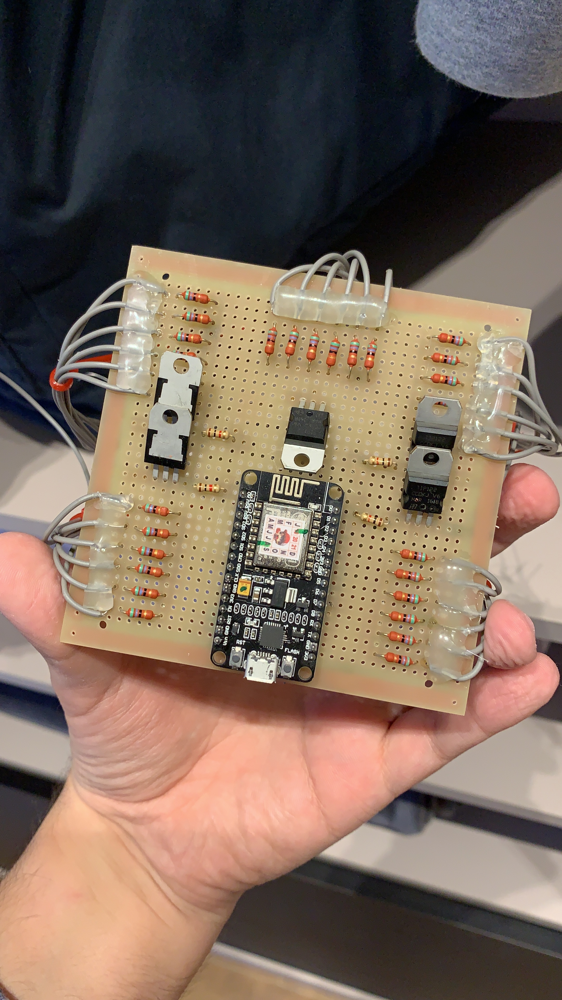
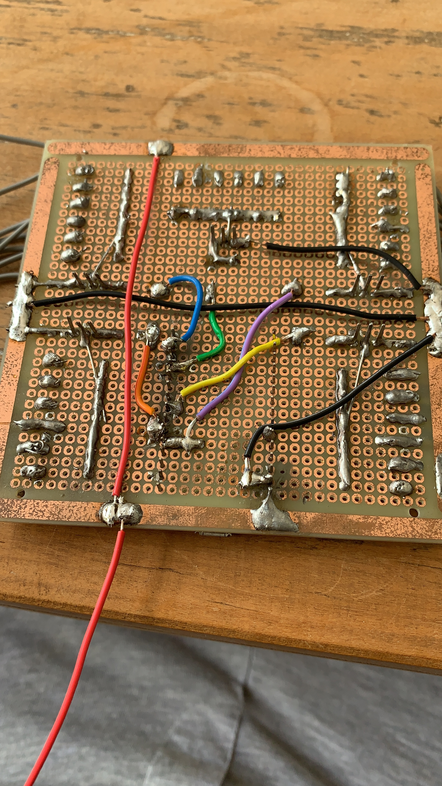
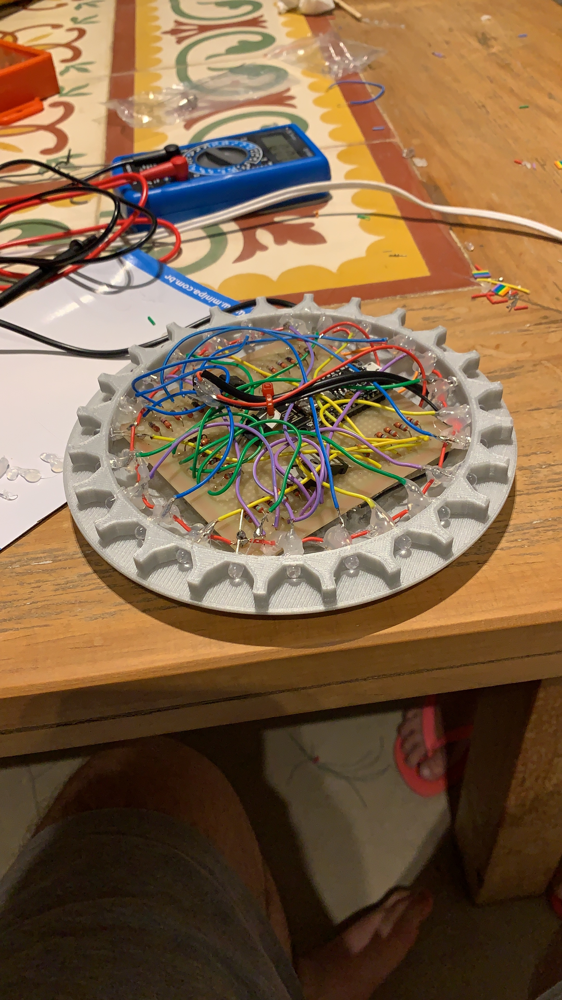
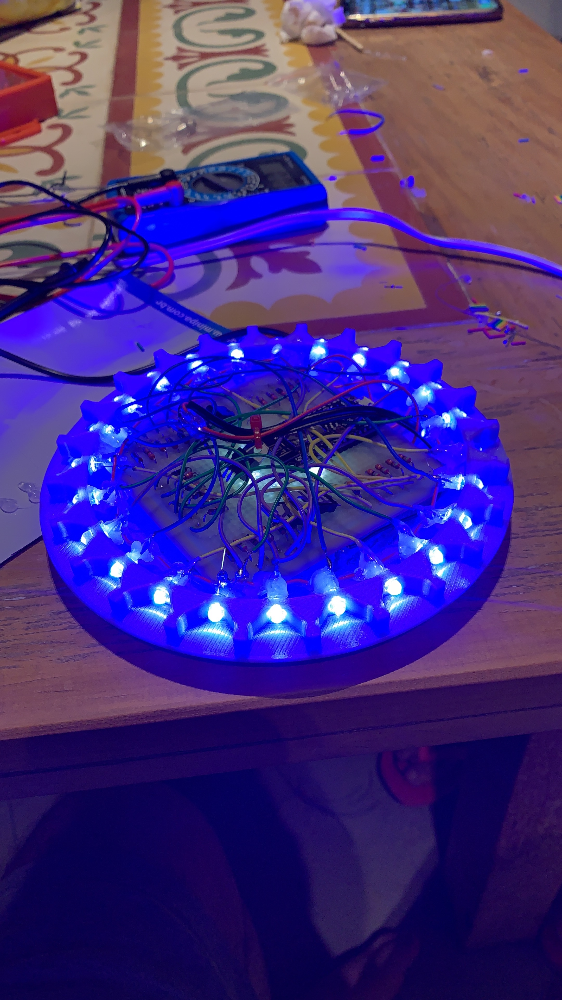

# UFO-LAMP

Cool UFO abduction lamp made using nodemcu integrated with Alexa

# Parts

| Quantity |         Part          |
| :------: | :-------------------: |
|    1     |   Power Suply 6v 2A   |
|    30    |      Blue LED`s       |
|    6     |      White LED`s      |
|    5     |        Tip122         |
|    1     |        NodeMcu        |
|    5     |     Resistor 1kΩ      |
|    30    |    Resistor 56Ω 1w    |
|    1     | Prototype Board 10x10 |
| 5 meters |  Ribbon Cable 6 ways  |
|    1     |    80mm glass tube    |
|   500g   |  Silver PLA Filament  |

# Project Images

|                     PCB TOP                     |                   PCB BOTTOM                    |                     UFO TOP                     |                   UFO TOP ON                    |
| :---------------------------------------------: | :---------------------------------------------: | :---------------------------------------------: | :---------------------------------------------: |
|  |  |  |  |

# TODO: Schematics
